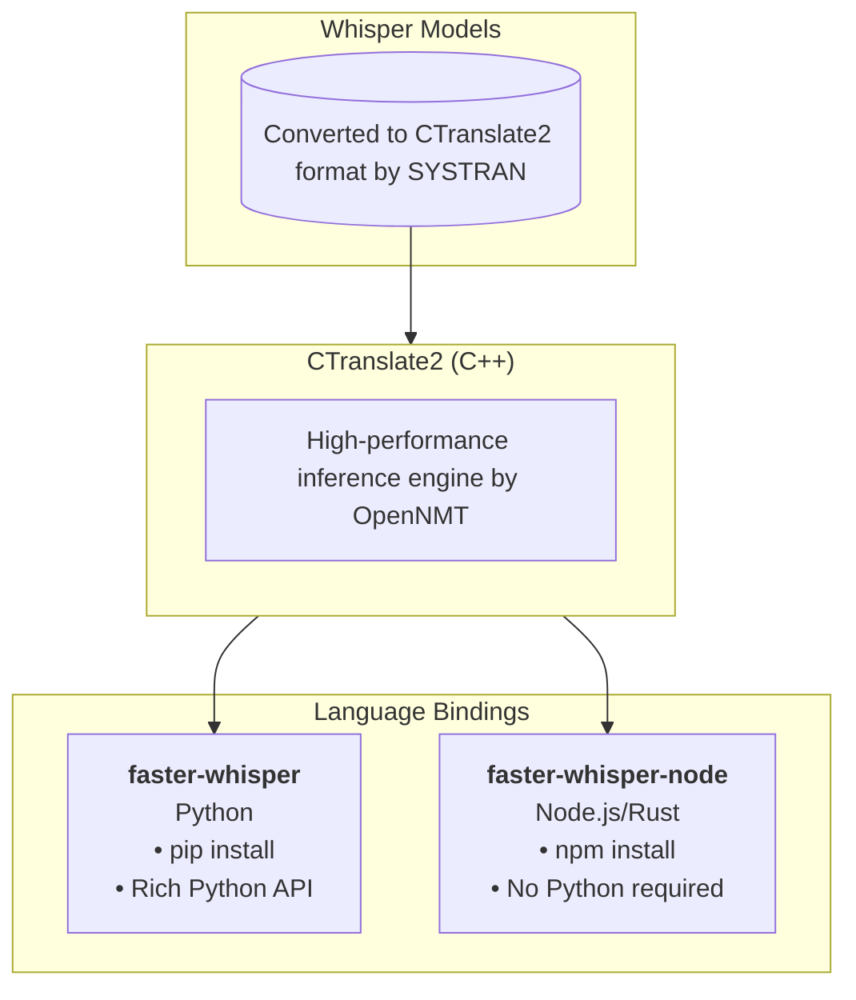
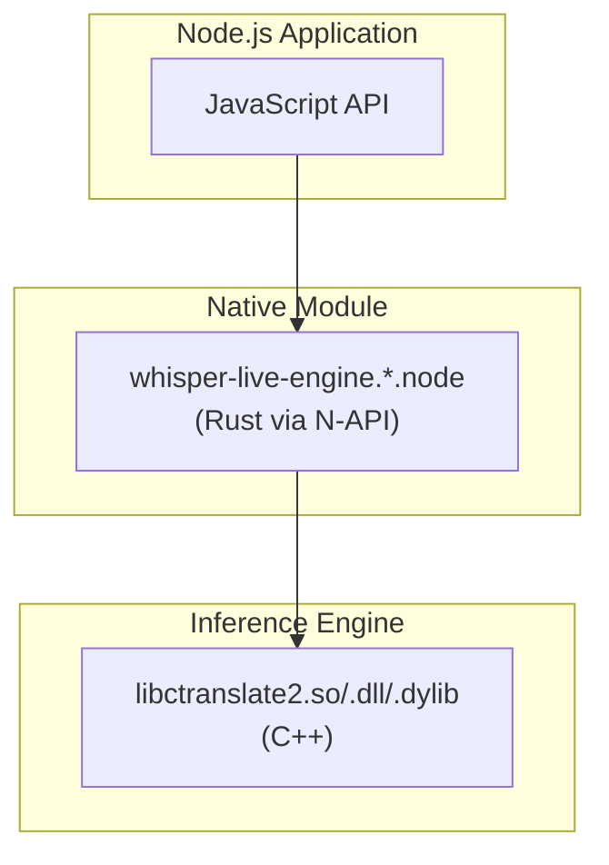

# faster-whisper-node

<p align="center">
  <a href="https://github.com/manmal/faster-whisper-node/actions/workflows/ci.yml"></a>
  <a href="https://www.npmjs.com/package/faster-whisper-node"></a>
  <a href="https://opensource.org/licenses/MIT"></a>
  <a href="https://nodejs.org"></a>
</p>

A pure Node.js/Rust module for Whisper speech-to-text transcription. **No Python runtime required.**

Uses [CTranslate2](https://github.com/OpenNMT/CTranslate2) as the inference engine, the same battle-tested backend that powers [faster-whisper](https://github.com/SYSTRAN/faster-whisper).

## Why This Exists

[faster-whisper](https://github.com/SYSTRAN/faster-whisper) is an excellent Python library that provides fast Whisper inference via CTranslate2. However, integrating Python into Node.js/Electron applications introduces significant complexity:

| Challenge | Python Approach | This Package |
|-----------|-----------------|--------------|
| **Runtime dependency** | Requires Python interpreter + pip packages | `.node` binary + CTranslate2 shared library |
| **Distribution** | Bundle Python or require user installation | npm install (prebuilt binaries) |
| **Electron/Node integration** | Child process or Python bridge | Native N-API module |
| **Cold start time** | Python interpreter startup overhead | Native code, instant loading |
| **Cross-platform packaging** | Complex (pyinstaller, conda, etc.) | Standard npm workflow |

**This package provides the same CTranslate2 inference speed with zero Python dependencies.**

> **⚠️ Current Limitations:** This package currently provides **plain text transcription only**. Advanced features available in the Python version (timestamps, word-level confidence, VAD, streaming) are not yet exposed. Audio must be pre-converted to 16kHz mono WAV format (e.g., using `ffmpeg`).

## Relationship to faster-whisper



### When to Use Which

| Use Case | Recommended |
|----------|-------------|
| Python application | [faster-whisper](https://github.com/SYSTRAN/faster-whisper) |
| Node.js/Electron app (plain text) | **faster-whisper-node** |
| Python scripts & notebooks | [faster-whisper](https://github.com/SYSTRAN/faster-whisper) |
| Need timestamps/subtitles (SRT/VTT) | [faster-whisper](https://github.com/SYSTRAN/faster-whisper) |
| Need word-level confidence/VAD | [faster-whisper](https://github.com/SYSTRAN/faster-whisper) |
| Shipping desktop app without Python | **faster-whisper-node** |
| Serverless/container with Node.js | **faster-whisper-node** |

### Credits

This project stands on the shoulders of giants:

- **[SYSTRAN/faster-whisper](https://github.com/SYSTRAN/faster-whisper)** — The original fast Whisper implementation and model conversions
- **[OpenNMT/CTranslate2](https://github.com/OpenNMT/CTranslate2)** — The incredible inference engine that makes this fast
- **[ct2rs](https://github.com/jkawamoto/ctranslate2-rs)** — Rust bindings for CTranslate2

---

## Architecture



- **Node.js layer**: JavaScript API
- **Rust layer**: N-API bindings via [napi-rs](https://napi.rs/), audio processing, Whisper interface via [ct2rs](https://crates.io/crates/ct2rs)
- **C++ layer**: CTranslate2 inference engine

---

## Platform Support

| Platform | Architecture | Status | Binary Source |
|----------|--------------|--------|---------------|
| Linux | x86_64 | [](https://github.com/manmal/faster-whisper-node/actions/workflows/ci.yml) | [PyPI wheel][pypi-files] |
| Linux | arm64 | [](https://github.com/manmal/faster-whisper-node/actions/workflows/ci.yml) | [PyPI wheel][pypi-files] |
| macOS | arm64 (Apple Silicon) | [](https://github.com/manmal/faster-whisper-node/actions/workflows/ci.yml) | [PyPI wheel][pypi-files] |
| macOS | x86_64 (Intel) | [](https://github.com/manmal/faster-whisper-node/actions/workflows/ci.yml) | [PyPI wheel][pypi-files] |
| Windows | x86_64 | [](https://github.com/manmal/faster-whisper-node/actions/workflows/ci.yml) | [PyPI wheel][pypi-files] |

[pypi-files]: https://pypi.org/project/ctranslate2/#files
[ct2-repo]: https://github.com/OpenNMT/CTranslate2

### Binary Sources


- **All platforms**: Prebuilt binaries extracted from [PyPI wheels](https://pypi.org/project/ctranslate2/#files) using `curl` + `unzip` (no Python required)

See [`THIRD_PARTY_LICENSES.md`](./THIRD_PARTY_LICENSES.md) for license information.

---

## Installation

### For End Users (npm package)

```bash
# npm
npm install faster-whisper-node

# pnpm
pnpm add faster-whisper-node

# yarn
yarn add faster-whisper-node
```

#### Platform-Specific Requirements

| Platform | Additional Requirements |
|----------|------------------------|
| **Linux** | None (prebuilt binaries included) |
| **Windows** | [Visual C++ Redistributable](https://aka.ms/vs/17/release/vc_redist.x64.exe) (usually already installed) |
| **macOS** | None (prebuilt binaries included) |

### For Development (building from source)

#### Prerequisites

| Platform | Requirements |
|----------|--------------|
| **All** | [Node.js](https://nodejs.org/) v18+, [Rust](https://rustup.rs/) |
| **macOS** | Xcode Command Line Tools (`xcode-select --install`) |
| **Linux** | `apt install build-essential unzip` (or equivalent) |
| **Windows** | [Visual Studio Build Tools](https://visualstudio.microsoft.com/visual-cpp-build-tools/) |

#### Build Steps

```bash
# Clone with submodules
git clone --recursive https://github.com/manmal/faster-whisper-node
cd faster-whisper-node

# Download prebuilt CTranslate2 (auto-detects platform)
./scripts/download-prebuilt.sh

# Build the Node.js module
npm install
npm run build
```

---

## Usage

### 1. Download a Model

Models are hosted on Hugging Face by SYSTRAN (the faster-whisper team):

```bash
# Using git (recommended for large models)
mkdir -p models && cd models
git lfs install
git clone --depth 1 https://huggingface.co/Systran/faster-whisper-tiny tiny

# Or download directly
mkdir -p models/tiny && cd models/tiny
curl -LO https://huggingface.co/Systran/faster-whisper-tiny/resolve/main/model.bin
curl -LO https://huggingface.co/Systran/faster-whisper-tiny/resolve/main/config.json
curl -LO https://huggingface.co/Systran/faster-whisper-tiny/resolve/main/tokenizer.json
curl -LO https://huggingface.co/Systran/faster-whisper-tiny/resolve/main/vocabulary.json
```

**Available models:** `tiny`, `base`, `small`, `medium`, `large-v2`, `large-v3`

Create the required `preprocessor_config.json`:

```bash
cat > models/tiny/preprocessor_config.json << 'EOF'
{
  "chunk_length": 30,
  "feature_extractor_type": "WhisperFeatureExtractor",
  "feature_size": 80,
  "hop_length": 160,
  "n_fft": 400,
  "n_samples": 480000,
  "nb_max_frames": 3000,
  "padding_side": "right",
  "padding_value": 0.0,
  "processor_class": "WhisperProcessor",
  "return_attention_mask": false,
  "sampling_rate": 16000
}
EOF
```

### 2. Transcribe Audio

```javascript
const { Engine } = require('faster-whisper-node');

// Load model (do this once, reuse for multiple transcriptions)
const engine = new Engine('./models/tiny');

// Transcribe a WAV file
const result = engine.transcribe('./audio.wav');
console.log(result);
// Output: " Hello, world!"
```

### 3. Audio Format Requirements

Audio must be WAV format with these specifications:

| Property | Required Value |
|----------|----------------|
| Sample rate | 16000 Hz |
| Channels | Mono (1) |
| Bit depth | 16-bit PCM |

**Convert with ffmpeg:**

```bash
ffmpeg -i input.mp3 -ar 16000 -ac 1 -acodec pcm_s16le output.wav
```

---

## API Reference

### `Engine`

```javascript
const { Engine } = require('faster-whisper-node');
```

#### `new Engine(modelPath)`

Creates a new transcription engine.

| Parameter | Type | Description |
|-----------|------|-------------|
| `modelPath` | `string` | Path to the model directory |

#### `engine.transcribe(audioPath)`

Transcribes an audio file.

| Parameter | Type | Description |
|-----------|------|-------------|
| `audioPath` | `string` | Path to WAV file (16kHz, mono, 16-bit PCM) |

**Returns:** `string` — The transcribed text

#### `engine.samplingRate()`

Returns the expected audio sample rate for the model.

**Returns:** `number` — Sample rate in Hz (typically 16000)

---

## Testing

```bash
# Create test audio (macOS)
say -o test.aiff "Hello world"
ffmpeg -i test.aiff -ar 16000 -ac 1 -acodec pcm_s16le test.wav -y

# Create test audio (Linux with espeak)
espeak "Hello world" --stdout | ffmpeg -i - -ar 16000 -ac 1 -acodec pcm_s16le test.wav -y

# Run tests
npm test
```

---

## Project Structure

```
faster-whisper-node/
├── scripts/
│   ├── build-mac.sh          # Build CTranslate2 from source (macOS)
│   ├── build-linux.sh        # Build CTranslate2 from source (Linux)
│   ├── download-prebuilt.sh  # Download prebuilt binaries (Linux/Windows)
│   └── post-build.js         # Copy libs after Rust build
├── crates/
│   └── engine/
│       ├── Cargo.toml        # Rust dependencies
│       ├── build.rs          # Cross-platform linker config
│       └── src/lib.rs        # Rust implementation
├── lib_build/                # CTranslate2 build output
│   └── lib/
├── models/                   # Whisper models
├── index.js                  # Node.js entry point
└── package.json
```

---

## Troubleshooting

### "Image not found" / "cannot open shared object file"

The shared library isn't being found. Solutions:

**Option 1:** Run post-build to copy libraries
```bash
npm run postbuild
```

**Option 2:** Set library path

| Platform | Command |
|----------|---------|
| Linux | `export LD_LIBRARY_PATH=$PWD/crates/engine:$LD_LIBRARY_PATH` |
| macOS | `export DYLD_LIBRARY_PATH=$PWD/crates/engine:$DYLD_LIBRARY_PATH` |
| Windows | Add `crates\engine` to `PATH` |

### Model loading fails

Ensure your model directory contains all required files:

| File | Description |
|------|-------------|
| `model.bin` | Model weights |
| `config.json` | Model configuration |
| `tokenizer.json` | Tokenizer data |
| `preprocessor_config.json` | Audio preprocessing config |

### Windows: "VCRUNTIME140.dll not found"

Install the [Visual C++ Redistributable](https://aka.ms/vs/17/release/vc_redist.x64.exe).

---

## License

MIT

See [`THIRD_PARTY_LICENSES.md`](./THIRD_PARTY_LICENSES.md) for third-party licenses.
